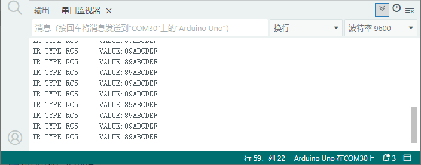

# 项目二十四 红外接收

## 1.实验说明

这一实验中，了解红外接收传感器的使用方法。红外接收传感器主要采用VS1838B红外接收传感器元件。该元件是集接收、放大、解调一体的器件，内部IC就已经完成了解调，输出的就是数字信号。它可接收标准38KHz调制的遥控器信号。

实验中，利用红外接收传感器接收外部红外发射设备发射的红外信号，并将接收信号在串口监视器上显示。

## 2.实验器材

- keyes brick 红外接收传感器*1
- keyes UNO R3开发板*1
- 传感器扩展板*1
- 3P 双头XH2.54连接线*1
- USB线*1

## 3.接线图


## 4.测试代码

```c
// 引入红外遥控库，用于发送和接收红外信号
#include <IRremote.h>

// 引入SimpleTimer库，用于实现定时器功能（非阻塞式延迟）
#include <SimpleTimer.h>

// 创建一个红外发送对象，使用数字引脚2作为红外信号输出引脚
IRsend irsend_2(2);

// 创建一个SimpleTimer定时器对象
SimpleTimer timer;

// 红外协议类型名称数组，用于将协议代码转换为可读字符串
const String IR_PROTOCOL_TYPE[] = {
  "UNKNOWN",          // 0 - 未知协议
  "PULSE_DISTANCE",   // 1 - 脉冲距离编码协议
  "PULSE_WIDTH",      // 2 - 脉冲宽度编码协议
  "DENON",            // 3 - DENON协议
  "DISH",             // 4 - DISH协议
  "JVC",              // 5 - JVC协议
  "LG",               // 6 - LG协议
  "LG2",              // 7 - LG2协议
  "NEC",              // 8 - NEC协议
  "PANASONIC",        // 9 - 松下协议
  "KASEIKYO",         // 10 - KASEIKYO协议
  "KASEIKYO_JVC",     // 11 - KASEIKYO JVC协议
  "KASEIKYO_DENON",   // 12 - KASEIKYO DENON协议
  "KASEIKYO_SHARP",   // 13 - KASEIKYO SHARP协议
  "KASEIKYO_MITSUBISHI", // 14 - KASEIKYO 三菱协议
  "RC5",              // 15 - RC5协议
  "RC6",              // 16 - RC6协议
  "SAMSUNG",          // 17 - 三星协议
  "SHARP",            // 18 - SHARP协议
  "SONY",             // 19 - 索尼协议
  "ONKYO",            // 20 - ONKYO协议
  "APPLE",            // 21 - 苹果协议
  "BOSEWAVE",         // 22 - BOSE协议
  "LEGO_PF",          // 23 - 乐高PF协议
  "MAGIQUEST",        // 24 - MAGIQUEST协议
  "WHYNTER"           // 25 - WHYNTER协议
};

// 创建一个红外接收对象，使用数字引脚3作为红外信号输入引脚
IRrecv irrecv_3(3);

// 定时器回调函数：当定时器触发时执行此函数
void Simple_timer_1() {
  // 通过引脚2发送一个32位的RC5红外编码信号，数据值为0x89ABCDEF
  irsend_2.sendRC5(0x89ABCDEF, 32);
}

// 初始化函数，在程序开始时执行一次
void setup() {
  // 设置定时器：每1000毫秒（1秒）触发一次Simple_timer_1函数
  // L后缀表示长整型，确保时间值正确
  timer.setInterval(1000L, Simple_timer_1);
  
  // 初始化串口通信，波特率9600，用于调试输出
  Serial.begin(9600);
  
  // 启用红外接收功能，开始接收红外信号
  irrecv_3.enableIRIn();
}

// 主循环函数，会重复执行
void loop() {
  // 运行定时器，检查并执行到期的定时任务
  timer.run();
  
  // 检查是否接收到红外信号
  if (irrecv_3.decode()) {
    // 获取解码后的红外数据结构的指针
    struct IRData *pIrData = &irrecv_3.decodedIRData;
    
    // 提取解码后的原始数据（32位无符号整数）
    long ir_item = pIrData->decodedRawData;
    
    // 根据协议编号获取协议名称字符串
    String irProtocol = IR_PROTOCOL_TYPE[pIrData->protocol];
    
    // 通过串口打印接收到的红外协议类型和数值（十六进制）
    Serial.print("IR TYPE:" + irProtocol + "\tVALUE:");
    Serial.println(ir_item, HEX);
    
    // 恢复接收状态，准备接收下一个红外信号
    irrecv_3.resume();
    
  } 
}
```

## 5.代码说明

1. 将红外发射模块连接到D2引脚处
2. 将红外接收模块连接到D3引脚处，在Project23课程的代码的基础上添加红外接收的代码。
3. 这样就能实现引脚D2发射红外值，引脚D3接收红外值了

## 6.测试结果

按照接线图接线，上传测试代码成功，利用USB线上电后，打开串口监视器，里面就会显示红外接收传感器接收到的数据。

