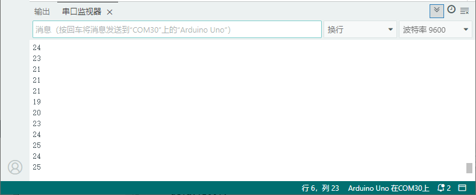

# 项目四十九 超声波模块模拟钢琴

## 1.实验说明

在前面一章节，实验八中，我们学会了利用无源蜂鸣器模块，调节响起声音的频率；实验二十二，我们学会了利用超声波传感器检测前方障碍物的距离。我们可以将两个实验结合在一起。设置时，我们通过超声波传感器测试出障碍物距离。然后，我们利用距离大小控制无源蜂鸣器上模块上蜂鸣器响起对应频率的声音。搭建好电路后，我们可以人为控制超声波前方障碍物，控制检测距离，从而达到控制声音响起频率，模拟钢琴演奏。

## 2.实验器材

- keyes brick HC-SR04超声波传感器*1
- keyes brick 无源蜂鸣器模块*1
- keyes UNO R3开发板*1
- 传感器扩展板*1
- 3P 双头XH2.54连接线*1
- 4P 双头XH2.54连接线\*2
- USB线*1

## 3.接线图


## 4.测试代码

```c
int distance;
//读取超声波测距函数
float checkdistance_12_13() {
  digitalWrite(12, LOW);
  delayMicroseconds(2);
  digitalWrite(12, HIGH);
  delayMicroseconds(10);
  digitalWrite(12, LOW);
  float distance = pulseIn(13, HIGH) / 58.00;
  delay(10);
  return distance;
}

void setup() {
  Serial.begin(9600);
  pinMode(12, OUTPUT);
  pinMode(13, INPUT);
  pinMode(3, OUTPUT);
}

void loop() {
  distance = checkdistance_12_13();
  Serial.println(distance);
  //如果距离小于等于10CM播放`Do`
  if (distance <= 10) {
    tone(3, 262, 250);
    //如果距离大于10CM小于等于20CM播放`Re`
  } else if (distance > 10 && distance <= 20) {
    tone(3, 294, 250);
    //如果距离大于20CM小于等于30CM播放`Re`
  } else if (distance > 20 && distance <= 30) {
    tone(3, 330, 250);
    //如果距离大于30CM小于等于40CM播放`Re`
  } else if (distance > 30 && distance <= 40) {
    tone(3, 349, 250);
    //如果距离大于40CM小于等于50CM播放`Re`
  } else if (distance > 40 && distance <= 50) {
    tone(3, 392, 250);
    //如果距离大于50CM小于等于60CM播放`Re`
  } else if (distance > 50 && distance <= 60) {
    tone(3, 440, 250);
    //如果距离大于60CM小于等于70CM播放`Re`
  } else if (distance > 60 && distance <= 70) {
    tone(3, 494, 250);
    //如果以上条件都不满足就停止播放
  } else {
    noTone(3);
  }
  delay(100);
}
```

## 5.代码说明

1.  设置时，通过调节不同距离范围，设置声音频率

2.  为方便控制障碍物距离，在上面代码中，根据实际情况，在控制逻辑里调节距离范围。

3.  实验代码中当10CM以内有障碍物时蜂鸣器发出`Do`，10到20以内蜂鸣器发出`Re`，20到30以内蜂鸣器发出`Mi`，30到40以内蜂鸣器发出`Fa`，40到50以内蜂鸣器发出`Sol`，50到60以内蜂鸣器发出`La`，60到70以内蜂鸣器发出`Si`，

## 6.测试结果

上传测试代码成功，按照接线图接好线，上电后，打开串口监视器，设置波特率为9600.检测到障碍物不同距离时，外接无源蜂鸣器模块上蜂鸣器响起不同频率的声音。
