# 项目二 双色LED模块调节LED颜色

## 1.实验说明

在这个套件中，有一个keyes brick双色LED模块，它采用F5-红绿共阴雾状LED元件。控制时，我们需要将模块R G连接单片机PWM口，GND接地线。我们通过调节两个PWM值，控制LED元件显示红光、绿光的比例，从而控制双色LED显示不同颜色。

实验中，我们通过2个测试代码，两种控制方法，控制它显示不同颜色。

## 2.实验器材

- keyes brick 双色LED模块*1

- keyes UNO R3开发板*1

- 传感器扩展板*1

- 3P双头XH2.54连接线*1

- USB线*1

## 3.接线图

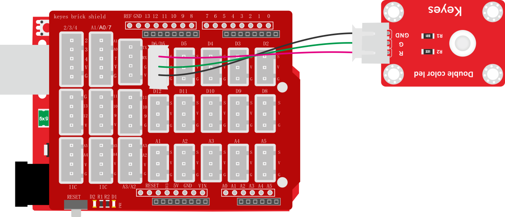

## 4.测试代码

**代码1：**

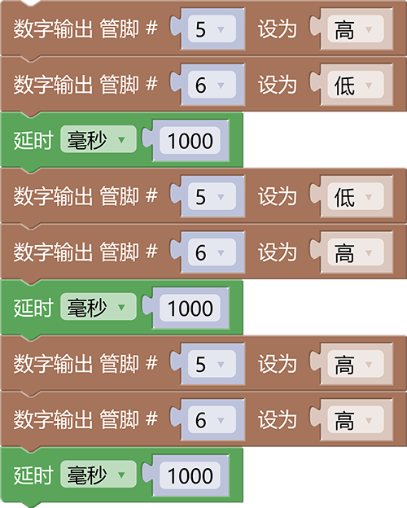

**代码2：**

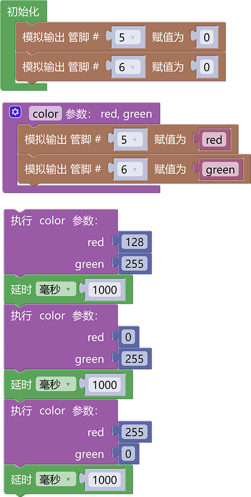

## 5.代码1说明

1. 在实验中，在单元内，找到以下模块并添加两个这个模块到代码编辑区。

2. 分别把管脚设置为5与6，当引脚5 设置为高时绿灯亮，当引脚6设置为高时红灯亮；当引脚5与6都设置成高时红灯绿灯一起亮就会出现混合色，当引脚设置为低时，对应的灯则不亮。

## 6.代码2说明

1. 初始化 时设置D5 D6的PWM值为0，熄灭模块上双色 LED。

2. 开始设置一个子程序，找到函数选项，找到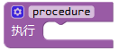项，选择使用该单元。

3. 点击标志设置子程序框架，将拉入，连续拉入2个该单元；点击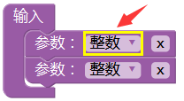设置3个参数类型，我们都设置为整数，点击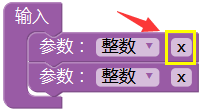设置参数名称；子程序框架设置成功，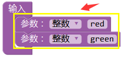，点击标志，退出子程序框架设置。设置完后，我们可以在单元中，找到设置的2个名称的参数。

4. 设置框架成功后，显示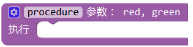，点击，设置子程序名称，我们设置为color。

5. 子程序框架名称设置成功后，我们就开始设置子程序。根据接线，我们D6控制双色LED显示红光，D5控制双色LED显示绿光。我们利用这2个PWM口的PWM值控制双色LED显示不同颜色。控制对应的PWM值越大，对应显示的颜色比例越重。因此，子程序我们设置为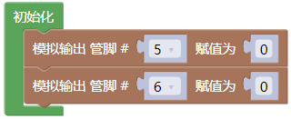。

6. 子程序设置成功后，我们就可以在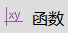中找到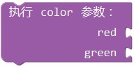，这里我们通过设置这2个参数，控制模块上双色ED显示不同颜色、亮度，理论来说，可以设置双色LED显示多种颜色，总共有255\*255种排列组合。

7. 设置时，如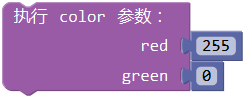表示使双色LED显示最亮的红色。

   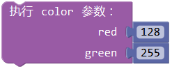表示使双色LED显示混合颜色，颜色比例为红：绿为128:255。

## 7.测试结果

上传测试代码1成功，上电后，模块上双色LED循环显示对应设置的3种颜色，间隔时间为1秒。上传测试代码2成功，上电后，模块上双色LED显示对应设置的3种颜色，循环不止，间隔时间为1秒。