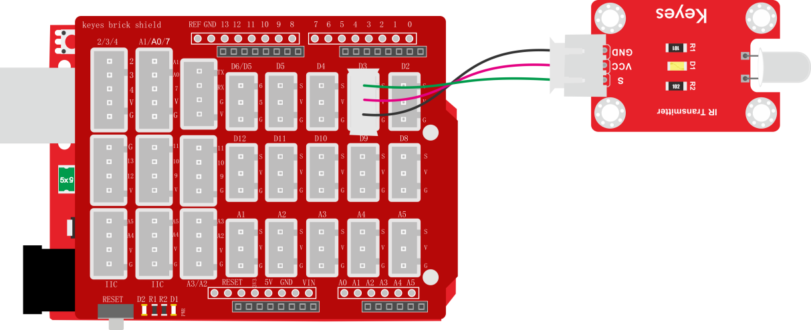

# 项目二十三 红外发射

## 1.实验说明

在这个套件中，有一个红外发射传感器，它主要用到了红外发射管。它是一个能发射出特定波长红外光的二极管。我们可以将传感器连接到单片机上，利用编程，控制传感器发射出38KHz调制信号，可适应市面上各种红外接收头，以便红外线接收传感器能接收到，从而实现红外无线通讯。

实验中，我们利用红外发射传感器发射对应数据，每发射一次数据，传感器上的D1 LED就闪烁一次。

## 2.实验器材

- keyes brick 红外发射传感器*1
- keyes UNO R3开发板*1
- 传感器扩展板*1
- 3P 双头XH2.54连接线*1
- USB线*1

## 3.接线图

## 4.测试代码

## 5.代码说明

1. 在找到拖到代码编辑区，设置一个定时器定时每秒发送一次红外值

2. 在找到中的，根据接线，把管脚设置为3。设置需要发送的数值以及比特数为“32”。

## 6.测试结果

按照接线图接线，上传测试代码成功，红外发射模块就会每个一秒钟发射一次红外值，发射时模块上的红色LED灯会闪烁一下。

