# 项目四 贴片RGB模块调节LED颜色

## 1.实验说明

在这个套件中，有一个贴片RGB模块，它采用5050 RGB
高亮LED元件。控制时，我们需要将模块R G B连接单片机PWM口，+接5V。我们通过调节3个PWM值，控制LED元件显示红光、绿光和蓝光的比例，从而控制RGB模块上LED显示不同颜色灯光。当设置的PWM值越大，对应显示的颜色比例越低。理论来说，通过调节这3中颜色光的混合比例，可以模拟出所有颜色的灯光。

实验中，我们通过测试代码，控制模块上RGB LED显示几个常用颜色。

注意：该模块是共阳的，对应的控制引脚输出低电平才能点亮！！PWM控制时值越小灯越亮。

## 2.实验器材

- keyes brick 贴片RGB模块*1

- keyes UNO R3开发板*1

- 传感器扩展板*1

- 3P双头XH2.54连接线*1
- USB线*1

## 3.接线图

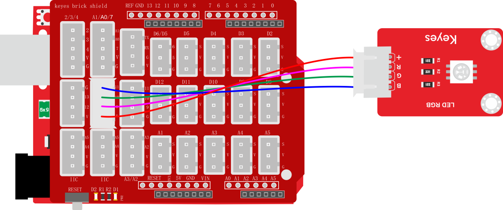

## 4.测试代码

**代码1：**

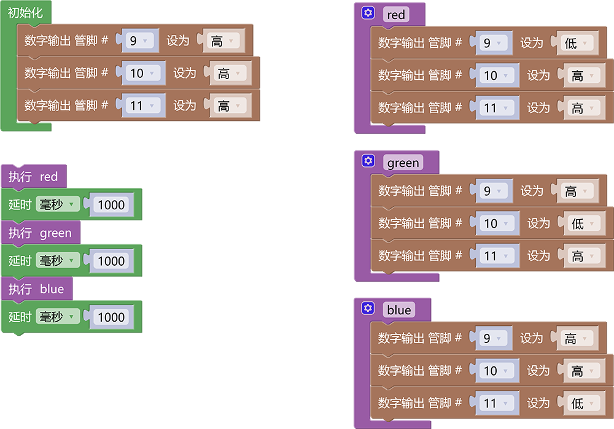

**代码2：**

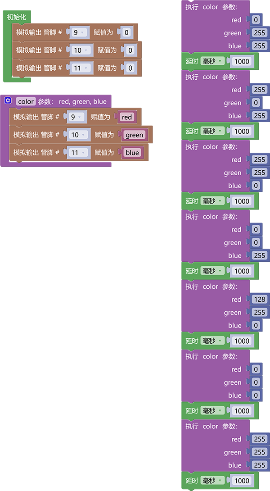

## 5.代码1说明

1. 在栏中托出模块
1. 在单元内，找到以下模块。

2. 在初始化模块中添加数字输出模块，将引脚9，10，10输出设为“高”。

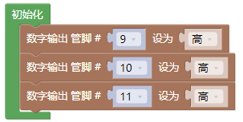

3. 在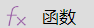中托出代码块修改名称为“red”，并在函数中设置引脚9输出低电平，引脚10与11输出高电平（这样就将红灯点亮，绿灯与蓝灯熄灭)

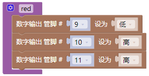

4. 使用同样的方法添加名为“green”的函数以及名为“blue”的函数，在“green”函数中设置引脚10输出低电平，引脚9月11输出高电平（只点亮绿灯），在“blue”函数中设置引脚11输出低电平，引脚9与10输出高电平（只点亮蓝灯）

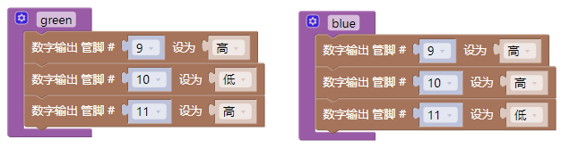

## 6.代码2说明

1. 在栏中托出模块
2. 从中找到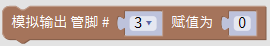模块，
3. 将控制引脚输出模拟值的代码块放到模块中，分别设置引脚9，10，11，输出模拟值“0”

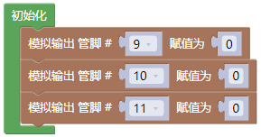

4. 在中托出代码块修改名称为“color”，并给函数添加三个参数点击标志设置子程序框架，将拉入，连续拉入3个该单元，将后方的参数名“x”分别修改成“red”，“green”，“blue”；

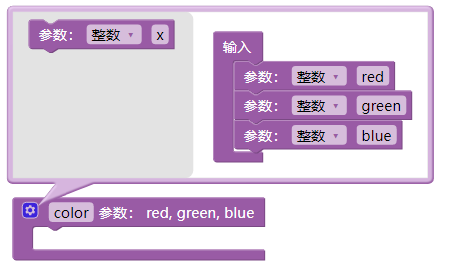

5. 分别添加引脚9，10，11输出模拟值的代码块到函数“color”中，然后在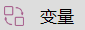中找到“red”，“green”，“blue”三个变量的代码块，将“red”添加到引脚9输出的模拟值中，将“green”添加到引脚10输出的模拟值中，将“blue”添加到引脚11输出的模拟值中。

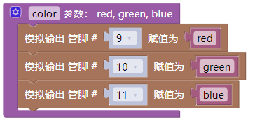

6. 然后我们就可以调用函数“color”并通过控制红色，绿色，蓝色输出的值（0-255）从而搭配出混合色，以下是输出红色代码

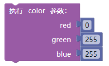

7. 输出绿色代码

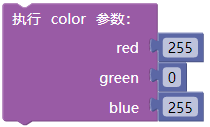

8. 输出蓝色代码

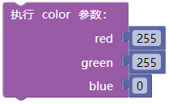

9. 输出红绿混合色代码（黄色）

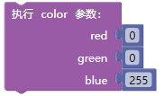

10. 输出半红与全蓝混合色代码（紫色）

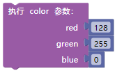

11. 输出白色代码

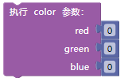

12. 熄灭所有灯光

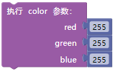

13. 代码中我们需要添加延时模块来以便我们更好的看到颜色的显示效果

## 7.测试结果

上传测试代码1成功，上电后，模块上RGB LED循环显示红绿蓝3种颜色，间隔时间为1秒。上传测试代码2成功，上电后，模块上RGB LED显示红绿蓝黄紫白6种颜色，然后熄灭，循环不止，间隔时间为1秒。