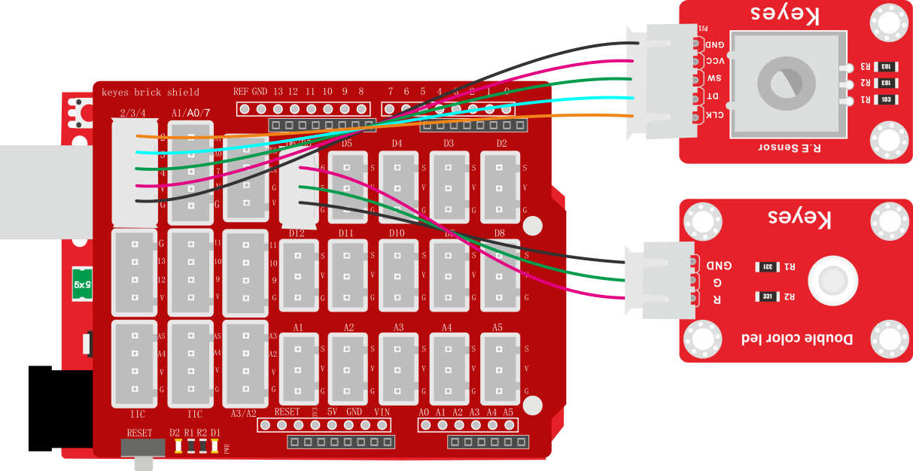
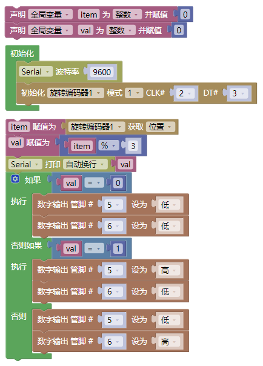
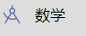
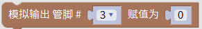
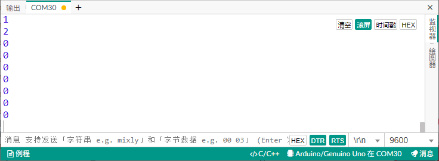

# 项目四十 旋转编码器模块控制双色LED模块

## 1.实验说明

在前面课程的实验二十中，我们利用旋转编码器计数。在这里我们将它扩展下，通过得出的计数，我们用来控制双色LED模块上LED显示不同颜色。

设计代码时，我们需要对所得数据取绝对值。然后我们将数据除以二，得到余数，余数为0控制双色LED模块上LED亮红光，余数为1，双色LED模块上LED亮绿光。

## 2.实验器材

- keyes brick 旋转编码器模块*1

- keyes UNO R3开发板*1

- keyes brick 双色LED模块*1

- 传感器扩展板*1

- 5P双头XH2.54连接线*1

- 3P 双头XH2.54连接线*1

- USB线*1

## 3.接线图

## 4.测试代码

## 5.代码说明

1. 在，找到，将+改成%，设置，即将val1设置为val除以3的余数。
2. 得到余数后，在找到，设置管脚，根据接线设置管脚为9（红灯）、10（绿灯）和11（蓝灯)。
3. 利用余数控制模块上LED显示对应灯光颜色。

## 6.测试结果

上传测试代码成功，按照接线图接好线，上电后，打开串口监视器，设置波特率为9600。旋转编码器，串口监视器显示对应余数。即可控制外接的RGB模块上的LED的颜色（红绿蓝）。

