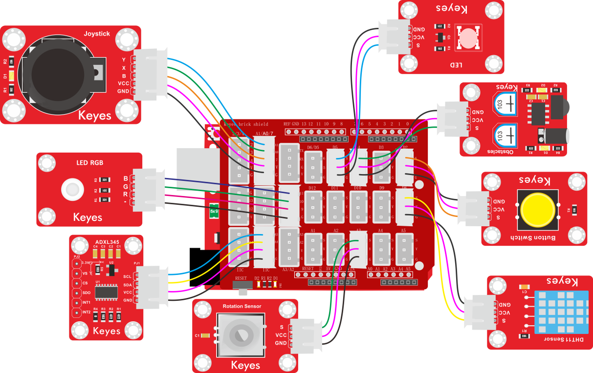
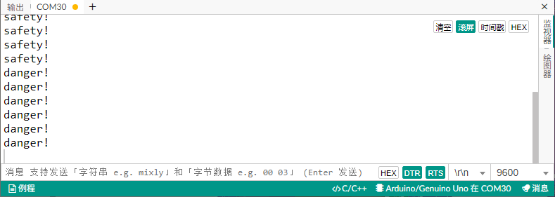
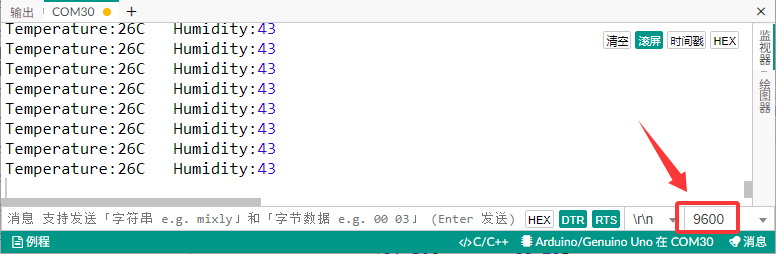
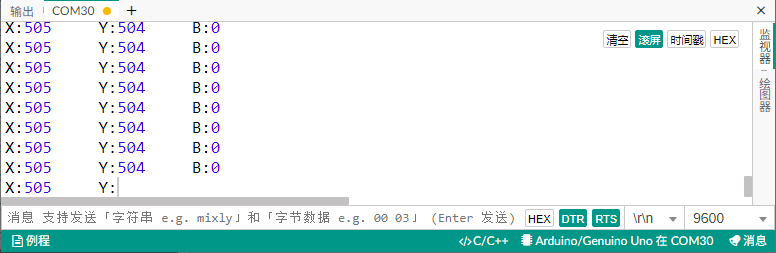
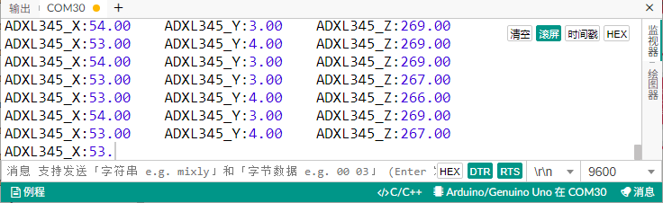
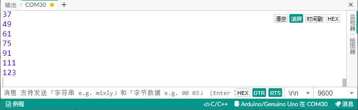

# 项目四十五 综合实验

## 1.实验说明

在前面我们做了很多实验，每做一个实验，我们都需要重新上传一次代码。那我们可以把多个实验组合在一起吗？可以的，在这一实验中，我们将第四章节中的实验三、实验二十四、实验二十六、实验三十五、实验三十七和本章节中的实验一，组合在一起。设置时，我们参考本章节实验四的方法，利用外接按键模块。每按一次按键，功能变换一次，实验功能循环交替。

## 2.实验器材

- keyes brick LED白发白模块*1
- keyes brick 按键传感器*1
- keyes brick DHT11温湿度传感器*1
- keyes brick ADXL345加速度传感器*1
- keyes brick 避障传感器*1
- keyes brick 摇杆模块传感器*1
- keyes brick 可调电位器模块*1
- keyes brick 插件RGB模块*1
- keyes UNO R3开发板*1
- 传感器扩展板*1
- 3P 双头XH2.54连接线\*5
- 4P 双头XH2.54连接线\*2
- 5P 双头XH2.54连接线*1
- USB线*1

## 3.接线图

## 4.测试代码

## 5.代码说明

1. 设置时，计算出按下按键的次数，除以6，得到余数，为0 ,1, 2, 3, 4 ,5，根据不同的余数，控制实验实现不同功能。
2. 实验中，都利用了子程序设置。
3. 参照介绍方法，可以在接线中添加或减少传感器/模块，然后在代码中更改实验功能。

## 6.测试结果

上传测试代码成功，按照接线图接好线，利用USB上电。

刚开始时，按键次数为0，余数为0，RGB模块上LED循环闪烁红绿蓝三种颜色。点击打卡串口监视器，设置波特率为9600，按一下按键（时间长些），按键次数为1，余数为1，RGB模块上LED显示蓝色，实验实现的功能是障碍物感应。如果我们避障模块感应到前方有障碍物就会在串口中打印“danger!”，没有感应到障碍物则打印“safety!”，串口监视器显示如下。

特别注意：如果先按下按键，按键次数变为1，再打开串口监视器时，程序会复位，按键成次数会变为0，需要再按下按键重新设置按键次数。

再按一下按键，按键次数为2，余数为2，实验实现的功能是利用DHT11温湿度传感器读取环境中的温湿度数值，每0.1秒读取一次，串口监视器显示数据如下图。

再按一下按键，按键次数为3，余数为3，实验实现的功能是读取摇杆模块传感器X轴和Y轴对应的模拟值，B（Z轴）接口对应的数字值，串口监视器显示如下图。

再按一下按键，按键次数为4，余数为4，实验实现的功能是利用ADXL345加速度传感器测试X Y Z 3轴加速度数值，单位为g，串口监视器显示如下图。

再按一下按键，按键次数为5，余数为5，实验实现的功能是利用外接可调电位器模块调节D5接口的PWM值，从而调节外接的LED白发白模块上LED的亮度。串口监视器显示图下图。

再按一下按键，按键次数为6，余数为0，实现初始时的现象。不断按下按键，余数循环变化，实验功能也循环变化。